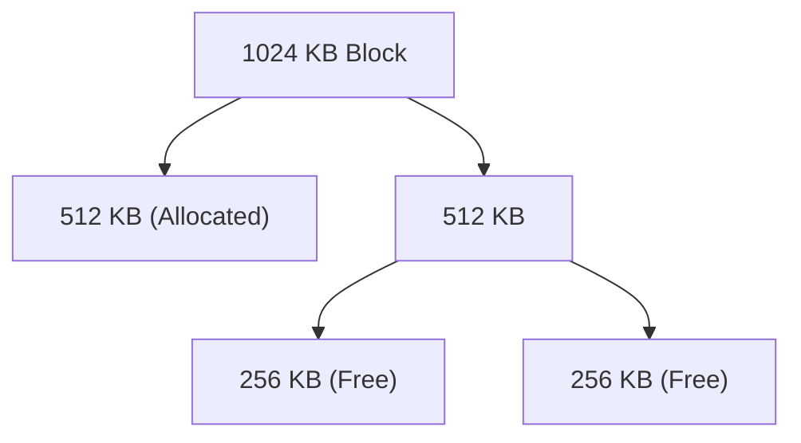

# Buddy Memory Allocator Skill

High-efficiency, zero-dependency Python implementation of the **Binary Buddy System Memory Allocator**.

## Features
- **Power-of-Two Splitting**: Minimizes external fragmentation via recursive block halving.
- **Fast XOR Coalescing**: Instant \(O(1)\) buddy pairing via bitwise XOR offset identity.
- **Zero External Dependencies**: Pure Python standard library.
- **Native MCP Protocol**: JSON-RPC 2.0 stdio server compatible with Claude Desktop, Cursor, and Windsurf.

## Architecture

